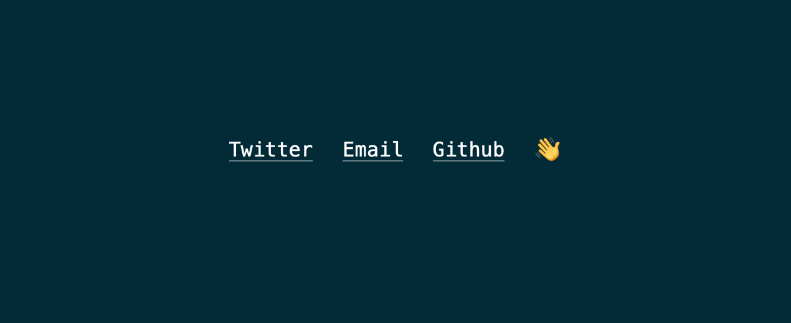

# [reasonml-labs/bs-css](https://github.com/reasonml-labs/bs-css) emotion footer demo

This is just a port of this [codepen](https://codepen.io/julesforrest/pen/qLpgNB).

See discussion [here](https://github.com/reasonml-labs/bs-css/issues/190#issue-589683809)

